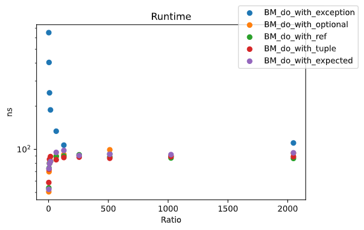

# Errorhandling benchmark <!-- omit in toc -->

- [Overview](#overview)
- [Introduction](#introduction)
- [Scenario](#scenario)
- [Compared approaches](#compared-approaches)
  - [Return value by reference and error by return](#return-value-by-reference-and-error-by-return)
  - [Return value and exception](#return-value-and-exception)
  - [Returning std::tuple<bool, T>](#returning-stdtuplebool-t)
  - [Returning std::optional<T>](#returning-stdoptionalt)
  - [Returning expected<T, E>](#returning-expectedt-e)
- [Benchmark results](#benchmark-results)
  - [Building and running benchmark](#building-and-running-benchmark)
  - [Optimized execution](#optimized-execution)
  - [Not optimized execution](#not-optimized-execution)

# Overview

There are different styles of error handling/propagation possible within C++, ranging from the ancient C-style that returns an error code up to exceptions and other more modern approaches. This little project should show some of these possibilities of error handling and compares them based on execution time.

# Introduction

One of the first questions that arise is: What is an error? Wikipedia states it's an action which is inaccurate or incorrect. According to this, an error is something that's not necessarily unexpected and thus can happen frequently. In terms of programming, i don't want to stick with this. 

To me, an error is something that is unexpected and not common within the regular workflow of a software. 

# Scenario

A common scenario for error handling/propagation is calling a function that returns a value (e.g. read from a device or some calculation) and that might fail due to an error or invalid usage. So this benchmarking is focused on a simple function that returns a double value, but the calculation might fail and thus an error should be signalized.

# Compared approaches

## Return value by reference and error by return

This is something you often see in C-style libraries and legacy code bases. Usually the possible return values (i.e. error codes/indicators) are defined globally (E_OK, E_FAIL, etc.) or the return type might have a special semantic (e.g. [memcmp](https://www.cplusplus.com/reference/cstring/memcmp/)). 
If the operation fails, the value of interest `result` might contain an arbitrary value. So checking the error indicator before using it is necessary.

```
    int by_ref(T & result ) const
    {
        if ( _data.empty() ) 
        {
            return E_FAIL;
        }

        result = mean();
        return E_OK;
    }
```

## Return value and exception

```
    T with_exception() const
    {
        if ( _data.empty() ) throw std::logic_error("No data for mean calculation");
        return mean();
    }
```

## Returning std::tuple<bool, T>

```
    std::tuple<bool, T> with_tuple() const
    {
        if (_data.empty()) return std::make_tuple(false, T{});
        return std::make_tuple(true, mean());
    }
```

## Returning std::optional<T>

```
    std::optional<T> with_optional() const
    {
        if ( _data.empty() ) return std::nullopt;
        return { mean() };
    }
```

## Returning expected<T, E>

```
    tl::expected<T, int> with_expected() const
    {
        if (_data.empty()) return tl::unexpected<int>(E_FAIL);
        return mean();
    }
```

# Benchmark results

## Building and running benchmark

    mkdir build && cd build
    cmake .. && make -j4

    ./bench

To export a CSV with multiple runs that's readable by the jupyter notebook, use:

    bench --benchmark_repetitions=25 --benchmark_report_aggregates_only=true --benchmark_format=csv > data.csv

## Optimized execution



## Not optimized execution


